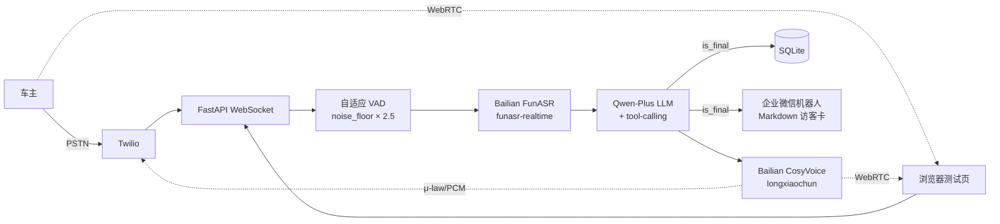

# Voice Agent · 园区访客登记系统

> 蓝色鲸鱼科技 Take-Home。打一通电话或打开浏览器，AI 自然对话采集车牌 / 公司 / 事由 / 手机号，25 秒内把结构化访客卡片推到门卫的企业微信。

🎬 **演示视频** — 点击下方缩略图在浏览器播放（36 MB · QuickTime）

[](https://cdn.hailuoai.com/mcp/u483437766881136645/general/1781073761_fb820091.mov)

[📖 测试指南](docs/TESTING.md) · 视频原始文件存在 `docs/demo.mov`

## 架构



**三条入口共用同一套 STT / LLM / TTS**（仅音频 transport 不同）：PSTN 电话 / 浏览器 WebRTC / 微信小程序。

## 快速开始

```bash
# 1. 装依赖
uv sync

# 2. 配环境变量
cp .env.example .env
# 编辑 .env：填 DASHSCOPE_API_KEY + WECHAT_WEBHOOK_URL

# 3. 起服务（本地）
./scripts/run_server.sh

# 4. 浏览器实测（需公网入口给浏览器麦克风权限）
cloudflared tunnel --url http://localhost:8000
# 打开 https://<随机>.trycloudflare.com/browser-test
```

可选 Docker：`docker compose up --build`

## 环境变量

| 变量 | 必填 | 说明 |
|---|---|---|
| `DASHSCOPE_API_KEY` | ✓ | 阿里云百炼 API Key（LLM + STT + TTS 同源） |
| `WECHAT_WEBHOOK_URL` | ✓ | 企业微信群机器人 webhook |
| `LLM_MODEL` | | 默认 `qwen-plus`，可换 `qwen-turbo`/`qwen-max` |
| `BAILIAN_STT_MODEL` | | 默认 `funasr-realtime` |
| `BAILIAN_TTS_VOICE` | | 默认 `longxiaochun`（女声） |
| `TWILIO_ACCOUNT_SID` | PSTN 必填 | Twilio 控制台获取 |
| `TWILIO_AUTH_TOKEN` | PSTN 必填 | 同上 |
| `TWILIO_PHONE_NUMBER` | PSTN 必填 | E.164 格式 |
| `PARK_NAME` | | 园区名，默认 `蓝色鲸鱼科技园` |
| `DATABASE_URL` | | 默认 SQLite；可换 MySQL/Postgres |

> 完整说明见 `.env.example`。

## 特性

- **自适应 VAD**：每 3 秒采样 noise floor × 2.5，低音量笔记本麦克风也能稳定识别
- **多字段一次性采集**：LLM 支持任意顺序提取车牌 / 公司 / 事由 / 手机号 / 联系人；text-parser 作为 LLM 不调工具时的兜底
- **三层 transport**：PSTN 电话 / WebRTC 浏览器 / 微信小程序扫码，同源后端
- **WeChat 卡片**：对话结束 1 秒内推送结构化访客卡到门卫群
- **可观测**：内置 `/dashboard` 路由查历史访问记录

## 局限

- Twilio 海外号码拨打中国大陆有国际长途限制（详见 `docs/TESTING.md`）
- FunASR streaming 单次静音超过 23 s 服务端会超时（已在 prompt 引导 LLM 主动收束）
- 浏览器入口需公网 tunnel（cloudflared / nginx）才能拿到麦克风权限